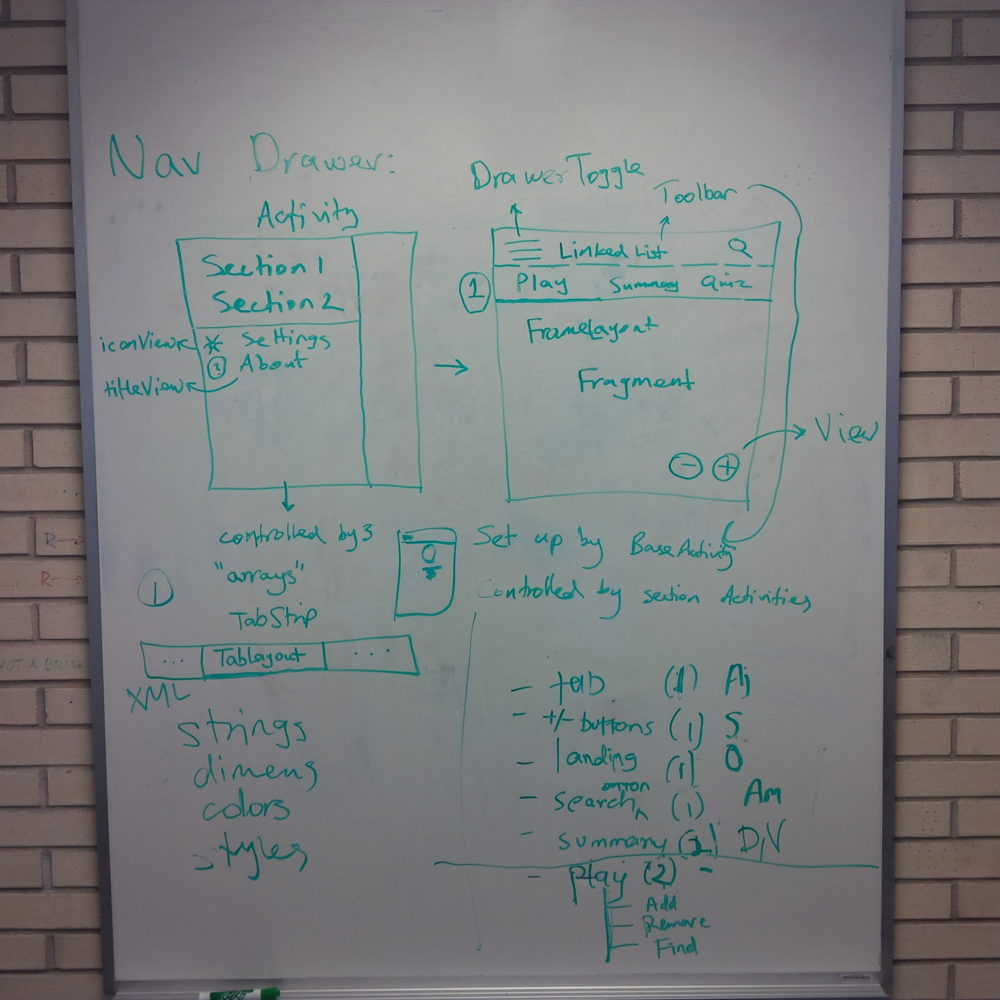

# Meeting Minutes
###### CSC301, Phase 2
###### Feb 16, 2015 (BA 2270)
###### Happy Family Day

_If you haven't already, then please read the Phase 2 handout._

Items of note:

* Getting all team members up to speed in terms of tool set setup.
* Created a new branch "app" for application development.
* Created Github issues to manage progress (more to come).
* Assigned preliminary issues to group members.

Nav Drawer:

- Each section
	- Activity
- Tab bar
	- Tab strip holds tab layout
- Each tab 
	- Fragment 
		- FrameLayout? (will Android do elevation?)

