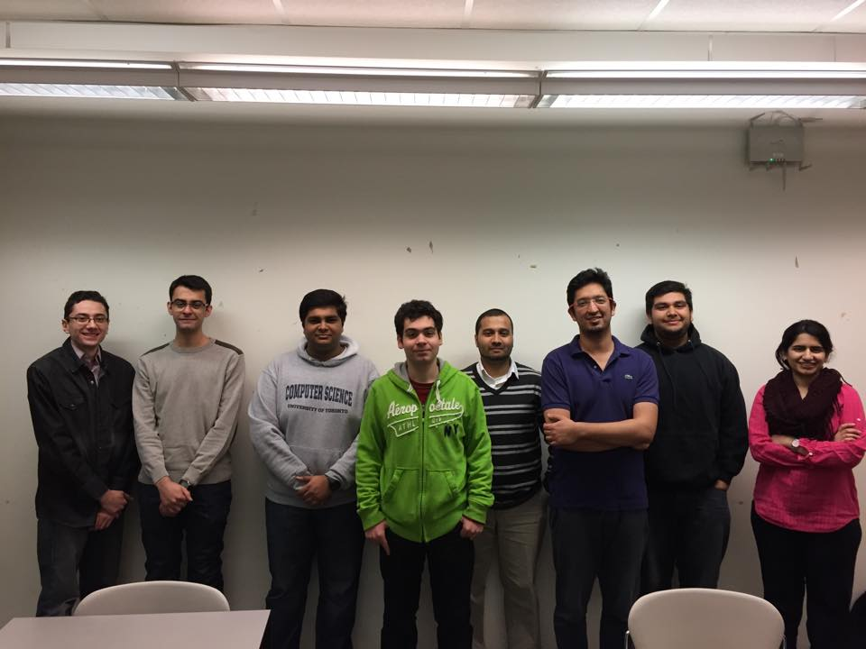
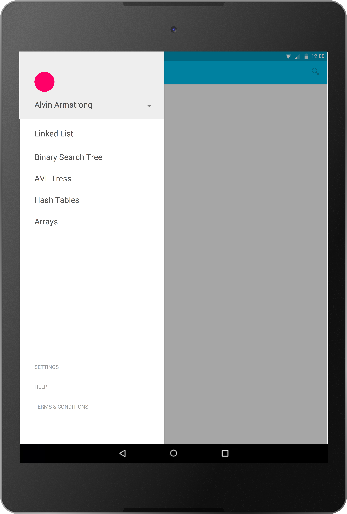
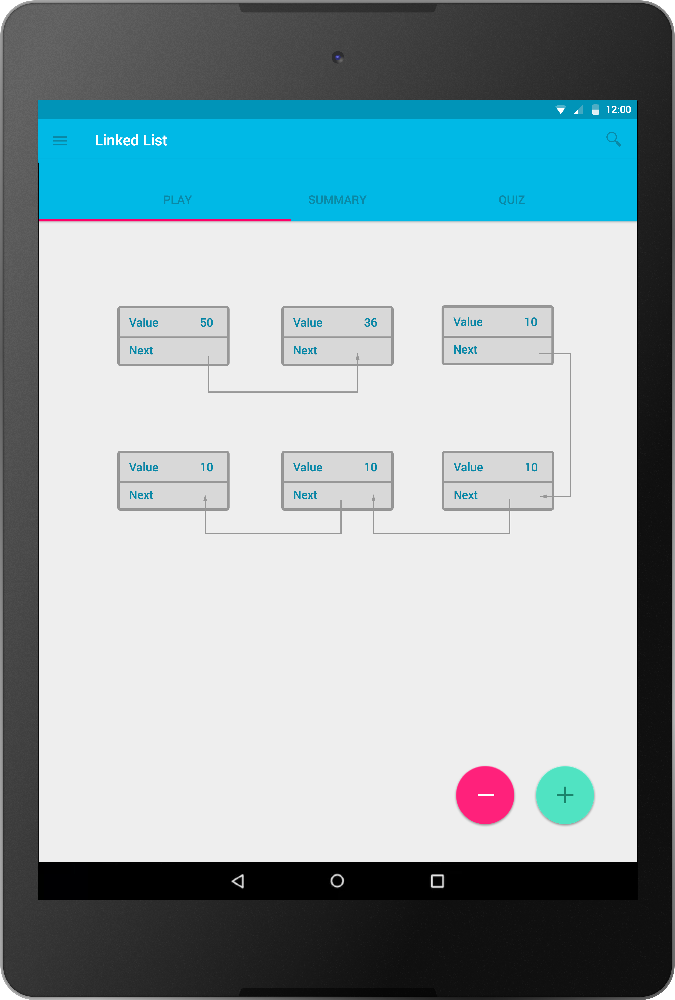
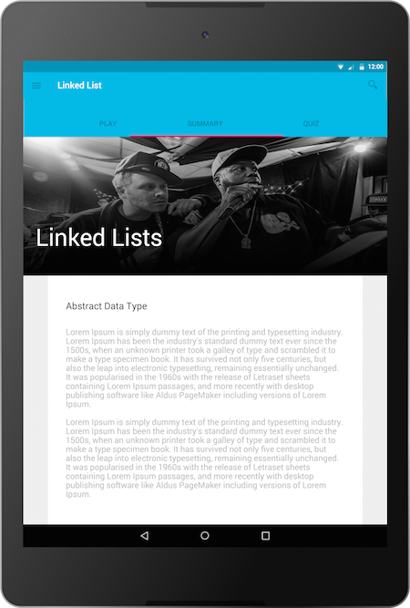
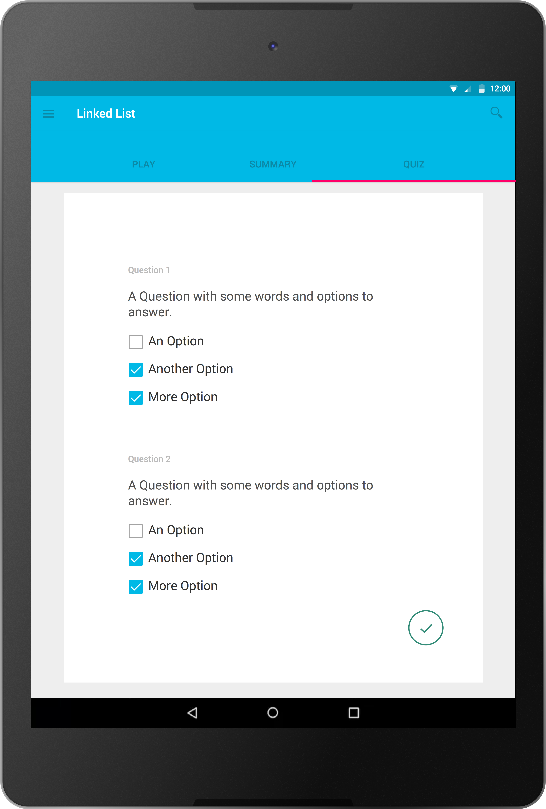

# Phase 1 - Planning #

## Introducing The Team ##

### Vaishali Deswal ###
Vaishali is a 4th year CS and Bioinformatics student at University of Toronto. She is a Python enthusiast and completing her fourth year project to create a tool to visualize RNA data of the plant, Arabidopsis Thaliana. She has recently gotten addicted to Quora.

### Ajit Pawar ###
Ajit is a fourth year Computer Science specialist at University of Toronto. He loves to attend hackathons and is always excited at the opportunity of using new hardware. He completed his PEY at BlackBerry (Waterloo) and is looking forward to apply his skills to this project. In his spare time, he loves to hit the gym, watch F1 and browse through some awesome sub-reddits to expand his mind. And of course he struggles with musical instruments :(

### Shahin Yousefi ###
Shahin is a third-year Computer Science specialist student at University of Toronto. His hobbies are Android programming and finding memes for any situation. He listens to way too much mainstream music and loves to stay up-to-date on tech news through social media. Despite being an introvert, he lives dangerously by using beta, alpha, or even pre-alpha software if it means he will get new features.

### Sean Williams ###
Sean is a third-year Computer Science and Political Science student at University of Toronto. He has an interest in video game development, and as a member of the UT Game Design and Development Club, has participated in a number of game development competitions and events. He is hoping to take away from this project greater experience in software development.

### Dhyey Sejpal ###
Dhyey Sejpal is a third year Computer Science Specialist. The project we will be working on is a mobile app. He has experience in designing the user interface of an app, building an app using agile development methods and am also currently working on two apps apart from this project. Technically speaking, he knows languages like Java, C++ and C, which are required in such projects. Apart from that, he has an immense passion for Entrepreneurship. He can work in teams very well, and encourages the practice, as it provides us with complementary skills and several viewpoints about a situation.

### Amit Prabhakar ###
Amit Prabhakar is a third year Computer Science Specialist at UofT. His hobbies include Web development and he's also a major car enthusiast with his dream car being the Nissan GT-R. Aside from that he will be working at Soti Inc. as a full-stack developer as apart of the PEY program. From this project he is hoping to enhance his Android development skills in both frontend and backend.

### Omar Hamdan ###
Omar Hamdan is third year Computer Science Specialist at UofT. With interests lying in comedy, philosophy and the philosophy of programming; publications like *Plato and a Platypus Walk Into a Bar*, *phrack.org*, *defenceindepth.com* and *stroustrup.com* are of great value to him. With high hopes, Omar wishes to make the best of this group project experience.   

### Ishan Thukral ###
Ishan is a third year Computer Science Specialist. He has worked on variety of mobie and web apps. He's previously intered at Yahoo, where he worked on the Yahoo Mail iOS and web client, collectively used by over 300 million users, before that he worked at Pivotal Labs making iOS and web apps for clients like RBC, CIBC and Boston Pizza. He's an experienced Tennis player, having played the game for over 15 years. In his free time, he plays the Guitar, struggles at singing and tries to watch as much Cricket as possible.

## Choosing The Project ##
Data structures are fundamental building blocks of Computer Science. In today's world, the need to conquer the inherent complexity of these concepts is critical for success. But, learning data structures can be intimidating for some. The abstractness of the concept can be hard to grasp and students can get stuck trying to "imagine" how it works. Existing teaching methods like videos (Khan Academy) and  text-based forums (StackOverflow) don't quite solve the problem. And this is why we chose to build Structura. We chose this problem space because we recognized there was not a single platform that helps students learn about data structures in an interactive manner. Our product will an insightful, organized and immersive way of learning about Trees, Lists, Hash Tables and Objects. Technical content will come from verified sources like textbooks and Wikipedia. Users will have an opportunity to choose from variety of topics with varying difficulty levels. As an added feature, we thought of implementing exercises and quizzes to give the user an opportunity to validate their learning. We will be making use of open source API and bootstraps to help us with the interactivity of the UI.

In essence, we wish to build a product that helps students learn by visualizing the abstract concepts in Computer Science

## Personas ##

### Savio ###
Savio is a 17 years old high school student in his senior year. He lives in North York, Toronto. He likes to play guitar on the side and was part of a garage band with his friends until last year. His parents are high school teachers. However, it is his uncle that Savio wants to follow in terms of career. His uncle is a Software Developer at TD bank and he got Savio interested in taking up the discipline. Thus, Savio tried a CS course in school and liked it very much. He has been accepted to University of Toronto Computer Science program and is very excited to start.

### Cynthia ###
Cynthia is a 1st year Computer Science student at the University of Toronto. She is 18 years old and currently single. She is taking the introductory courses of the Computer Science program. She started learning programming in high school and is excited to pursue it further. Since she is usually on campus till late,she is looking to get involved in extra curricular activities to complement her studies. She has a particular interest in Habitat for Humanity and the archery club at UofT. She has a long commute from Mississauga to the St. George campus and likes to read (books/lecture material) on her commute to campus.

### Seamus ###
Seamus is a student in his final year studying Computer Science at University of Toronto. He is 22 years old and lives in Vaughan, Ontario. He works part-time as a freelance web developer, while also working on MarkUs (CS department's grading software) as his final year project. He is an avid gamer with Halo and FIFA 2015 being his favourites. He also loves to network with new people and goes to a lot of Meet-ups around the city. He, like most of his graduating friends, is looking for full-time employment. He recently has scored interviews from IBM, Amazon and RBC Bank.

## User Stories ##

### Legend: ###

#### Priority: ####
1. We must have this feature, without it our product has no value to our users.
2. Valuable feature, but we can still release a product without it.
3. Might be valuable, but we should look at it later.

#### Difficulty: ####
1. Easiest
2. Medium
3. Hard

Each tuple is of the form (Priority, Difficulty). Sorted by Priority:

* **(1,1)** Savio wants to search a list of topics to learn because he is particularly interested in learning about Linked list for his midterm.
* **(1,3)** Seamus wants an interactive user interface because it  helps him create a visual data structure because he finds it difficult to understand by reading the textbook.
* **(1,2)** Savio wants to save the state of the app because he wants resume where he left off
* **(1,1)** Seamus wants to read summaries for topics because he needs a review for his upcoming exam
* **(1,3)** Savio wants to interact with structures through drag-and-drop because they find visual learning a more helpful tool
* **(2,3)** Seamus wants to insert a node into a data structure in order to build a tree because he is trying to learn the insert operation for trees.
* **(2,3)** Savio wants to delete a node because he wants to extract the maximum value
* **(2,2)** Cynthia logs in to Structura to learn about binary search trees because her friend recommended this app for learning data structures
* **(2,3)** Cynthia wants to tap on a BST because she wants to make a new node 
* **(2,3)** Savio wants to re-balance the tree because he wants to avoid making the tree one-side-heavy
* **(3,1)** Cynthia wants to login to the app because she want to load all her user data to continue learning about linked lists
* **(3,2)** Cynthia wants to be able to test her knowledge by doing simple online quizzes because she needs to prepare for her upcoming exam
* **(3,1)** Savio wants a user profile because we he wants to see his grade from a previous quiz

## MVP ##
Structura is a tool that allows people to learn data structures efficiently. The app consists of a list of various data structures to start from. They will be ordered in a particular manner so as to maximize learning, and guide beginners through the process. However, if you are not a beginner, the app has a feature that allows you to search for specific topics to learn. You can look up any of the available data structures and study them specifically, instead of going through the guided sections. Another cool feature in the app is being able to save your state. If you are in a hurry, or wish to look at your progress at a later time, Structura’s “Snapshot” feature will be handy. An app cannot appeal to the masses or please the current group of customers if it is not easy to use. Users will be mostly students, ranging from those in their first year, who can use this app to get a head start, or second year, who can review and practice lecture topics here, or even higher year students who can brush up their skills on these topics before job interviews, or prepare themselves for other courses. That is why Structura has a great, fluid UI, which would not only guide users through the app, but also provide a unique learning experience through interactivity in visualizing data structure operations, which is not possible to have in the classroom. It allows you to play with the individual elements of the data structure. And if one has already gone through the learning process using Structura, and wants a quick review before their exams, or an interview, Structura provides the “Summary” feature, which will consist of a brief description of the data structure, its operations, applications, and some of the abstract data types it supports. Thus, Structura is “the complete learning tool” for these concepts. 

Making this app will not be easy. There are obvious hurdles in this process. Some of them will be the difference in knowledge base of the group. But that is where we will turn it into our advantage. People from different backgrounds have different skills, and hence we will divide the tasks according to everyone’s strengths. Apart from that, co-ordination and schedule conflicts will be a problem, but then we have Git, and Slack to keep us organized.

## Release & Iteration Planning ##

In order to finish our app successfully, we need to divide and plan our work throughout the term. For our first release, which will be about 3 weeks long, we have decided to implement the following features:
1. Interactivity in creating a data structure to start learning, and then manipulate it using drag and drop features.

2. Adding the Singly linked list data structure and operations based on it, do get the users started with their learning, on a reasonably simple topic as compared to the more complex ones like trees, heaps, etc.

3.  Having summaries about various data structures provided in the app, to enable quick recalling of the topics without having to play through the app, or read 50 pages in textbook. 

4. Ability to save the state of the app locally, to enable resuming of the user’s progress.
The user stories marked with priority 1 cover these features, and will be implemented in the first release.

Some of the features that we excluded from the app are as follows:
1. Providing the Binary Search Tree data structure and its operations to learn through the app. This feature was excluded from the first release because it was difficult to implement in the given time of 3 weeks, along with the overhead of designing the basic layout of the app and getting the team to blend into the development process.

2. Having quizzes to test the user’s knowledge. This feature was excluded because of both, its less significance in the MVP, and its difficulty of implementation. The quizzes are a tool to test one’s knowledge. Our goal for the MVP is to first provide the knowledge to people. Testing can be done after that. Designing quizzes that are quick and also sufficient to test people’s knowledge is difficult, and needs more time, and hence should be done later.

3. Allowing user to have an account in the app and log in. This feature was excluded because of its low importance in our project idea. This is completely an extra feature, and not at all required currently. Later on, this can be added, and features can be built on top of it as well.

For the very first week of our release, that is, our first iteration, we plan to implement the interactivity feature of the app. The first step is to design the basic layout of the app, and make it interactive so that the users has a pleasurable experience in learning through the app. Then, features like adding the data structure, and summaries about it, and the state saving can be implemented. The first step required is the interactive framework to support these other features.

## CRC Cards ##

###### Summary
| Responsibility        | Collaboration           | 
| ------------- |:-------------:| 
| Information  |  |

###### Snapshot
| Responsibility        | Collaboration           | 
| ------------- |:-------------:| 
| Save |  |
| Load  |  |

###### Play Mode
| Responsibility        | Collaboration           | 
| ------------- |:-------------:| 
| Data Structure |  |
| Drag and Drop |  |
| Enter Value |  |

###### Search
| Responsibility        | Collaboration           |
| ------------- |:-------------:|
| Searchng |  |

###### Display
| Responsibility        | Collaboration           |
| ------------- |:-------------:|
| Display |  |

##CRC PLAY OUT

* Search: Savio launches Structura and taps on the search bar. This invokes the search responsibility which takes in a query and returns a list of topics. Tapping on a topic asks the Display CRC to display content of the topic to the main screen.
* Snapshot: Cynthia has been playing around with a data structure in Structura, but is now done working with the app. She exits out of the app and goes her merry way. Later, Cynthia opens Structura again and she can continue where she left off.
* Play Mode : Seamus launches the Structura app and searches for a linked-list. Once found he begins to drag and drop nodes, entering a value in each, to create a sorted linked-list. Then finally, Seamus saves his linked list to view it at a later time. 

## UI Mockups ##

**Drawer to select a Data Scruture**

**An interactive canvas to play around with different data scructure operations**

**A summary for the Data Scruture**

**Test your knowledge**

